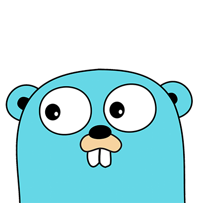

  

# Go - Training

From wikipedia

Go (often referred to as Golang) is a statically typed, compiled programming language which was designed at Google in 2007 to improve programming productivity in an era of multicore, networked machines and extremely large codebases. The designers wanted to address criticism of other languages in use at Google, while retaining their useful characteristics:

- Static typing and run-time efficiency (like C++ or Java)

- Readability and usability (like Python or JavaScript)

- High-performance networking and multiprocessing

### Prerequisites

Following are the minimum tested versions for the tools and libraries you need for running this repo:

- Go: go1.11.5 or newer

- Go Version Manager: v1.0.22 or newer

## Practices

### Table of Contents

- Basic
  - [**Hello app**](practices/2-hello-app/README.md)
